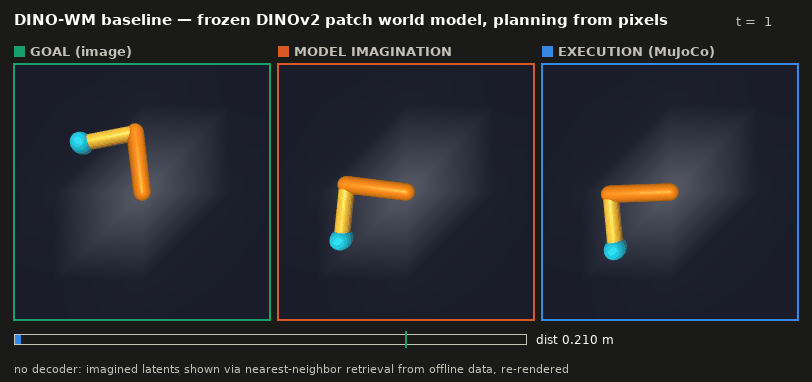
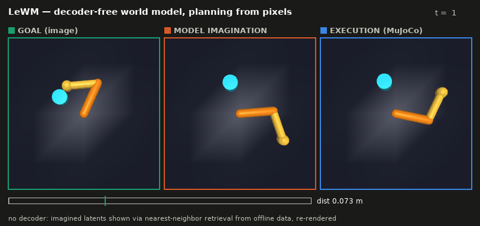
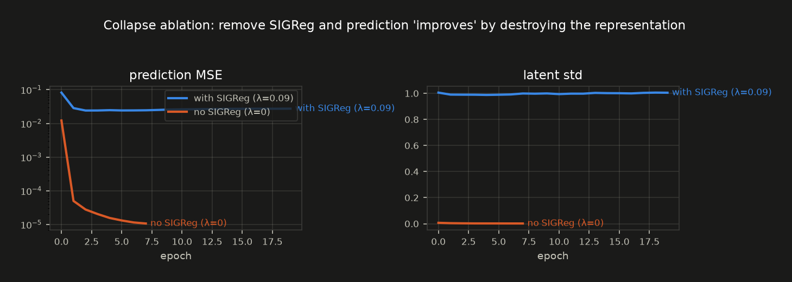

# small_world_model

World models, learned from first principles and built small: everything in this repo is
implemented from scratch, heavily commented, and trained on a single NVIDIA DGX Spark.
The centerpiece is a from-scratch **LeWorldModel** (LeWM, [arXiv:2603.19312](https://arxiv.org/abs/2603.19312))
trained on MuJoCo robot tasks and evaluated by goal-image planning — with a demo artifact
for every milestone.

**Why LeWM?** The strongest compute-per-result recipes of 2025–26 are small: LeWM trains a
stable pixel JEPA end-to-end at ~15M params in hours on one GPU — no frozen backbone, no
stop-gradient, no EMA teacher; a single statistical regularizer (SIGReg) replaces all of
them — and it beats DINO-WM on Push-T while planning up to 48× faster. Small is not the
compromise — it's the interesting regime. The full argument, with sources:
[docs/02-small-wm-frontier-2026.md](docs/02-small-wm-frontier-2026.md).

## The demos



*Goal-image planning, no rewards, no decoder: the planner sees only pixels; every
imagined latent is visualized by nearest-neighbor retrieval and re-rendered. This is
the frozen-DINOv2 patch-grid baseline on the reacher (56% success).*



*The contact task — pushing a puck to a goal-image position. Here the end-to-end
LeWM wins (24% vs 16%): its features were trained on exactly these contact dynamics.*



*The negative control, shipped: remove SIGReg (λ=0) and prediction loss "improves"
30× — by destroying the representation. Same code, one flag.*

## Milestones

| | Milestone |
|---|---|
| ✅ | **M0** — study foundation: field map, reading path, research sweep ([docs/](docs/)) |
| 🔨 | **M1** — LeWM from scratch on a simple MuJoCo task ([lewm/](lewm/)): train, plan, score |
| ⬜ | **M2** — scale the task ladder: reacher → pushing → Franka/Unitree assembly scenes |
| ⬜ | **M3** — the open question: LeWM vs DINO-WM on contact-rich manipulation, same data, same CEM protocol |
| ⬜ | **M4** — V-JEPA 2-AC-style post-training on our own robot data |
| ⬜ | **M5** — LoRA a pretrained generative WM → photoreal robot dreams |

Full plan: [docs/03-roadmap.md](docs/03-roadmap.md). (An earlier incremental "labs ladder"
— including the pixel-dynamics compounding-error demo — lives in git history before
2026-07-28; its verified LeWM components became [lewm/](lewm/).)

## The model in one diagram

```
frames (B,T,3,64,64) ──ViT-Tiny──► CLS ──MLP+BN──► z_t ∈ R^192      (one token per frame)
actions (B,T,A)      ──MLP──────────────────────► a_t ∈ R^192
(z, a) history ──causal transformer, AdaLN-zero action conditioning──► ẑ_{t+1}

L = ||ẑ_{t+1} − z_{t+1}||²  +  λ · SIGReg(z)          λ = 0.09, targets NOT detached
        prediction              anti-collapse: Epps–Pulley test of z against N(0,I)
                                on random 1-D projections (sketched Cramér–Wold)

Planning: encode goal image once, CEM over action sequences through latent rollouts,
cost = MSE to goal latent at the last step. No decoder anywhere.
```

## Results (48h campaign, 2026-07-28/29)

Goal-image planning, 25 episodes/row, success = target within 5 cm (first
passage), identical CEM planner and offline datasets (2000 episodes/task).
Chance baselines ran for every protocol version; a protocol only counts when
its zero/random floor is ~0%.

| Reacher (pose goals, start 0.19 m) | success | mean final dist |
|---|---|---|
| **DINO-WM** (frozen DINOv2 patch grid) | **56%** | 0.076 m |
| LeWM + probed-point cost *(diagnostic†)* | 28% | 0.085 m |
| LeWM + GoalMSE (paper's cost) | 12% | 0.179 m |
| collapsed (λ=0) / zero / random | 0% | ≈ start |

| Pusher (contact, rolled-out goals, start 0.072 m) | success | mean final dist |
|---|---|---|
| **LeWM** (fs=5, 12 ep) | **24%** | 0.066 m |
| DINO-WM | 16% | 0.066 m |
| zero baseline | 0% | 0.072 m |

† linear probe trained on offline state labels — an upper bound, not pure
goal-image planning.

**Finding 1 — the whitened-latent blind spot.** LeWM's latent *contains* the
state (linear probe: fingertip to 1.5 cm) but GoalMSE can't see it: SIGReg
whitens the space and latent distance decorrelates from task distance beyond
~5 cm (corr 0.35 → ~0.0). Evidence chain, each step committed: chance-floor
eval rebuild → 5-config CEM sweep (flat — planner exonerated) → rollout-drift
measurement (13% of random-pair distance at 8 steps — dynamics exonerated) →
RSA + probe (information present, metric blind) → probe-cost intervention
(12%→28%, distance halved) → DINO-WM baseline (56%: spatial patch structure
is what GoalMSE needs).

**Finding 2 — the crossover on contact.** The ordering flips on the pusher:
LeWM 24% > DINO-WM 16% (n=25, one seed — suggestive, not significant).
Consistent with the end-to-end thesis: features trained on the task's own
contact dynamics vs a generic pretrained prior.

**Finding 3 — evals lie by default.** Three protocol bugs each produced
plausible-looking numbers before being caught by controls: goals spawning
inside the success radius (every policy scored 100%), an MJCF degree-default
clamping the elbow to ±2.6° (goal images showed physically unreachable
poses), and goal images with the arm frozen at its current pose (cost
rewards not moving; both models cratered to 0-4%). The zero/random rows
stay in every table because they are what caught these.

**Efficiency** (single DGX Spark GB10, BF16, GPU-verified EGL rendering):

| | LeWM | DINO-WM baseline |
|---|---|---|
| trainable params | 8.75M (end-to-end) | ~11M head (22M frozen) |
| state per frame | one 192-d token | 49×384 patch grid |
| train (2000 eps) | ~50 min / 60 epochs | ~40 min / 10 epochs |
| CEM planning state | 192-d (fast) | 18.8k-d (~5× slower rollouts) |

## Repo layout

| Where | What |
|---|---|
| [`lewm/`](lewm/) | The LeWM implementation: model, SIGReg, MuJoCo envs, training, CEM planning/eval |
| [`docs/`](docs/) | Field map ([00](docs/00-landscape-2026.md)), reading path ([01](docs/01-reading-path.md)), frontier/efficiency research sweep ([02](docs/02-small-wm-frontier-2026.md)), roadmap ([03](docs/03-roadmap.md)) |
| [`notes/`](notes/) | Per-paper study notes ([template](notes/TEMPLATE.md)) |
| [`media/`](media/) | Demo artifacts, one set per milestone |

## Quick start

```bash
pip install -r requirements.txt
python -m lewm.collect            # MuJoCo reacher episodes -> data/
python -m lewm.train              # train LeWM; per-epoch collapse dashboard
python -m lewm.train --lambd 0    # the ablation: watch collapse live
python -m lewm.eval               # CEM goal-image planning -> success rate
```

Developed against Python 3.13 / PyTorch 2.11+cu128 / MuJoCo 3.11 (EGL, headless) on an
NVIDIA GB10 (DGX Spark, 121 GB unified memory). Everything trains in minutes-to-hours;
that's the point of "small" in the repo name.

## Working notes

Paper notes go in [`notes/`](notes/), one file per paper, using
[notes/TEMPLATE.md](notes/TEMPLATE.md). The template asks for the thing that is easy to
skip and most worth writing down: *what would break if you removed this paper's one idea.*
