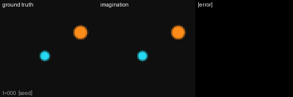
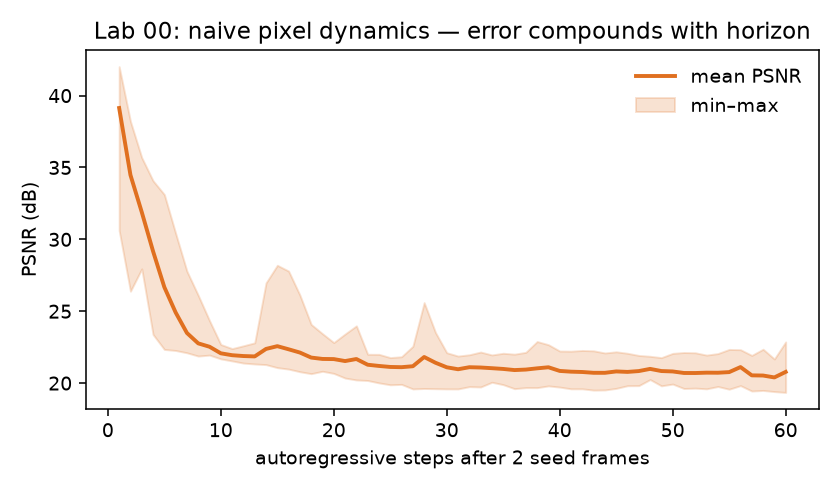

# small_world_model

World models, learned from first principles and built small: every model in this repo is
implemented from scratch, heavily commented, and trained on a single NVIDIA DGX Spark. The
project walks from a 1.4M-param naive dynamics model up to frozen-backbone robot-manipulation
world models with latent-space planning — with a demo video for every milestone.

**Why small?** The strongest compute-per-result recipes of 2025–26 are small: Drama matches
30M-param IRIS at 7M params, LeWM trains a stable pixel JEPA at 15M params in hours on one
GPU, and V-JEPA 2-AC gets zero-shot real-robot manipulation by training only a 300M head over
a frozen encoder. Small is not the compromise — it's the interesting regime. The full argument,
with sources: [docs/02-small-wm-frontier-2026.md](docs/02-small-wm-frontier-2026.md).

## Milestone demos

| | Milestone | Demo |
|---|---|---|
| ✅ | **M0** — naive pixel dynamics + compounding-error demo | below |
| ⬜ | **M1** — RSSM + policy learned purely in imagination | labs 01–03 |
| ⬜ | **M2** — tokens vs diffusion bake-off + MuJoCo data engine | labs 04–05 |
| ⬜ | **M3** — plan robot manipulation with DINO-WM-style MPC | lab 06 at scale |
| ⬜ | **M4** — V-JEPA 2-AC-style post-training on our own robot data | flagship |
| ⬜ | **M5** — LoRA a pretrained generative WM → photoreal robot dreams | |

Full plan: [docs/03-roadmap.md](docs/03-roadmap.md).

### M0 — the problem every world model exists to solve



A 1.4M-param action-conditioned conv net predicts the next frame of a 2D pushing environment.
One-step prediction is near-perfect (39 dB PSNR) — but roll it out autoregressively (red
border) and errors compound: the ball smears, physics quietly dies, PSNR halves within ~10
steps. Every architecture in this repo's ladder is a repair for what this GIF shows.



## Repo layout

| Where | What |
|---|---|
| [`docs/`](docs/) | Field map ([00](docs/00-landscape-2026.md)), reading path ([01](docs/01-reading-path.md)), frontier/efficiency research sweep ([02](docs/02-small-wm-frontier-2026.md)), roadmap ([03](docs/03-roadmap.md)) |
| [`labs/`](labs/) | The implementation ladder — each lab adds exactly one idea |
| [`notes/`](notes/) | Per-paper study notes ([template](notes/TEMPLATE.md)) |
| [`media/`](media/) | Demo artifacts, one set per milestone |

## The one-paragraph version

A world model is a learned simulator: given the current state of an environment and an action,
it predicts what happens next. That single idea splits into four families that disagree about
*what "next" should be predicted in* — pixels, discrete tokens, a compact stochastic latent, or
an abstract embedding that was never trained to reconstruct anything. Each choice buys
something (fidelity, controllability, compute, sample-efficiency) and costs something else.
Most of the 2024–2026 literature is that trade-off being renegotiated at larger scale. See
[docs/00-landscape-2026.md](docs/00-landscape-2026.md).

## The ladder

Each lab is standalone and adds one idea. You should be able to read any lab top to bottom in
one sitting.

| Lab | Adds | Anchor paper |
|---|---|---|
| **00** | Action-conditioned prediction in pixel space; compounding rollout error | — (baseline) |
| 01 | Learned latent space; predict in latent, decode for viewing | Ha & Schmidhuber 2018 |
| 02 | Stochastic latent state, KL-balanced ELBO (RSSM) | PlaNet / DreamerV2–V3 |
| 03 | Policy trained *inside* the model (imagination) | Dreamer |
| 04 | Discrete tokens + autoregressive transformer | IRIS / Genie |
| 05 | Diffusion / flow dynamics; shortcut forcing | DIAMOND / Dreamer 4 |
| 06 | Predict embeddings, not pixels; plan with MPC | DINO-WM / V-JEPA 2-AC |
| 07 | Evaluation: drift, memory, physics probes | WorldModelBench et al. |

**Lab 00 is implemented and runnable.** Labs 01–07 are specified in
[labs/README.md](labs/README.md) and get built as the reading reaches them.

## Setup

```bash
cd small_world_model
pip install -r requirements.txt
python -m labs.lab00_dynamics.run --help
```

Developed against Python 3.13 / PyTorch 2.11+cu128 on an NVIDIA GB10 (DGX Spark, 121 GB
unified memory). Nothing in labs 00–03 needs more than a few GB; the point of "small" in the
repo name is that every lab should train in minutes, not days.

## Working notes

Paper notes go in [`notes/`](notes/), one file per paper, using
[notes/TEMPLATE.md](notes/TEMPLATE.md). The template asks for the thing that is easy to skip
and most worth writing down: *what would break if you removed this paper's one idea.*
